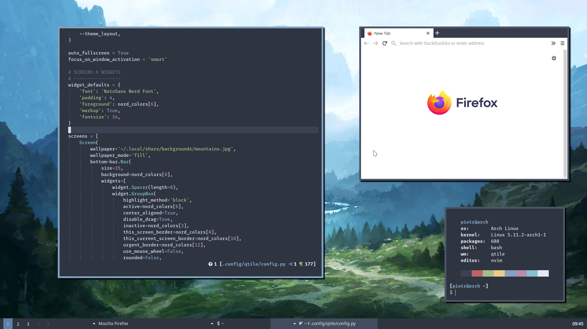
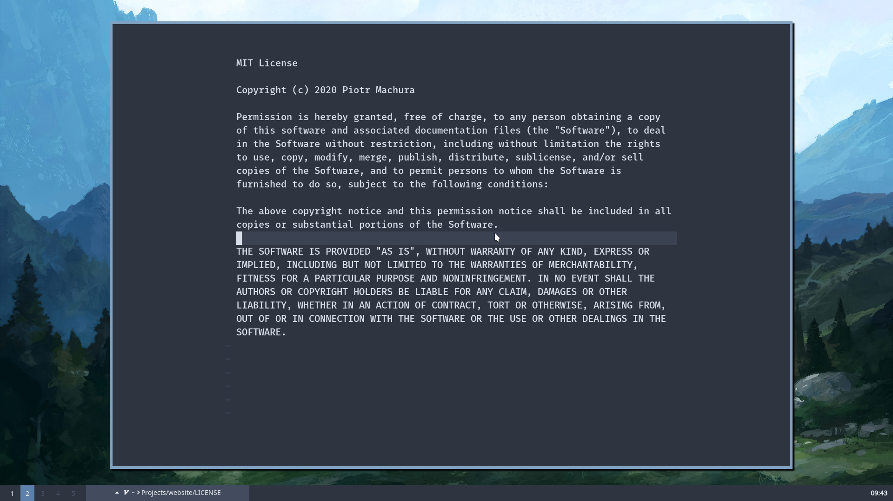

# Arch Linux setup


Setting up Arch Linux is not exactly difficult, but tedious none the less. And the more you customize it the more steps
there are to remember, so after two Virtual Box and one bare-metal installations I have decided to leave myself a rope
in the form of this very guide, documenting the setup of my machine, should I ever need to reproduce it in its entirety.
And i **really** mean entirety, down to every currently installed program.

Config files for all of the programs I use are located in my [setup
repository](https://github.com/piotr-machura/arch-setup). If you just want to grab some of them feel free to do so, this
guide is more of a *full package* sort of deal.

## Software
- **Window manager:** [Qtile](http://www.qtile.org/)
- **Terminal:** [Alacritty](https://github.com/alacritty/alacritty)
- **Editor:** [Neovim](https://neovim.io/)
- **File manager:** [Thunar](https://docs.xfce.org/xfce/thunar/start)
- **Browser:** [Firefox](https://www.mozilla.org/en-US/firefox/new/)
- **PDF viewer:** [Zathura](https://pwmt.org/projects/zathura/)

A complete list of all installed software is available under `~/.local/share/pacman/PKGLIST`.

## Screenshots






# Customization
Sadly, not everything can be kept in the dotfiles repo, some things require manual configuration. Especially when
installing Arch from scratch, it is useful to have *some* idea as to what to do next, assuming you have followed the
holy [Installation Guide](https://wiki.archlinux.org/title/Installation_guide).

It is also worth noting that most of the dotfiles should work on other Linux distros. Not many are Arch-specific.


## Cloning the repository
This section descibes a full **"dotfile installation"**, which should (ideally) come right after installing Arch and
booting properly for the first time. Skip it if you just want *some* of the dotfiles, not *all* of them.

All of the configuration files are in the [GitHub repository](https://github.com/piotr-machura/arch-setup), we just need
to get them from there and onto the system.

1. Create an alias `alias dots="/usr/bin/git --git-dir=$HOME/.conifg/dots --work-tree=$HOME"`
2. Clone the repo `git clone --bare https://github.com/piotr-machura/arch-setup.git $HOME/.config/dots`
3. Disable the showing of untracked files `dots config --local status.showUntrackedFiles no`
4. Apply the configs `dots reset --hard`

**Note:** the cloned `~/.config/git/config` contains a handy git alias, so that `git dots` will always access the
configs repo directly. Feel free to `unalias dots` now.

### Package installation
We will use the [paru](https://github.com/Morganamilo/paru) AUR helper to install all of our software. It wraps pacman,
allowing us to easily install software from the AUR the same we do with the official repos.

1. Clone the PKGBUILD `git clone https://aur.archlinux.org/paru-bin.git`.
2. cd into the `paru-bin` and run `makepkg -si`.
3. Verify installation `paru -Syyyy`.

You can now proceed with the installation of all the software. The cloned repo
contains a list of packages located in `~/.local/share/pacman/PKGLIST` and we will use it to download them all at once.

1. Obtain the gpg key needed for Spotify `curl -sS https://download.spotify.com/debian/pubkey.gpg | gpg --import -`.
2. Install the packages `paru -S --needed - < ~/.local/share/pacman/PKGLIST`.

### Pacman hooks
Link the included pacman hooks to the system-wide location `sudo ln ~/.local/share/pacman/*.hook /etc/pacman.d/hooks`.
The hooks also require that `sudo` knows where the user's `$HOME` is. This can be enabled in the sudoers file.
```none
visudo
------

Defaults env_keep += "HOME"
```
**Note:** hard links do not work well across partitions, so if your `/home` is on a different drive just copy the hooks
instead. Also, the `package-list.hook` contains some exceptions to the packages being tracked (microcode, video drivers
etc.). Examine it and you'll quickly figure out how to exclude additional ones.

The list contains a nice meta-package which allows us to group all of the base-devel utilities as its dependency with
`sudo pacman -S --asdeps $(pacman -Qqg base-devel)`.

## Systemd & firewall
**System-wide** services enabled with `systemctl enable <service name here>` :

- `systemd-timesyncd.service`
- `lightdm.service`
- `bluetooth.service`
- `ufw.service`
- `docker.service`

**User** services enabled with `systemctl enable --user <service name here>` :

- `neovim-undo-cleanup.service`

**Firewall:**

1. Enable the firewall `ufw enable`.
2. Disallow any incoming traffic `ufw default deny`.
3. Allow for file sync `ufw allow syncthing`.
4. Disable logging `ufw logging off`.

The last step is optional, but without it ufw does clutter the systemd logs quite a bit.

## LightDM & Xorg
The config is present in `~/.config/lightdm/lightdm-mini-greeter.conf`. We will link it to the system-wide
location shortly, but first:

**Warning:** the greeter we use is the [LightDM mini greeter](https://github.com/prikhi/lightdm-mini-greeter). It
requires specifying the user in config file. You **have** to change the `user` field in the cloned
`lightdm-mini-greeter.conf` or **you won't be able to log in**.

After you change the `user` field you may link it to the system-wide location with `sudo ln -f
~/.config/lightdm/lightdm-mini-greeter.conf /etc/lightdm`. Again, simply copy it if your `/home/` is on a different
partition.

To enable the greeter uncomment the following lines
```none
/etc/lightdm/lightdm.conf
-------------------------

[LightDM]
user-authority-in-system-dir=true
greeter-session=lightdm-mini-greeter
logind-check-graphical=true
```

### Screensaver
By default the X11 screensaver will blank out the screen after ~10 minutes of inactivity. If, like me, you find this
behavior annoying, create or edit
```none
/etc/X11/xorg.conf
------------------

Section "ServerFlags"
    Option "BlankTime" "0"
EndSection
```
### Screen tearing
If you experience screen tearing (especially when watching videos in Firefox) edit the following
```none
/etc/X11/xorg.conf.d/20-<intel or amd here>.conf
-------------------------------------------

Section "Device"
    Identifier  "<Intel Graphics or AMD here>"
    Driver      "<intel or amdgpu here>"
    Option      "TearFree" "true"
EndSection
```

## Git & GitHub
We will now configure git and GitHub to sign commits with a gpg key and push using an SSH key. If you already have a key
(e.g. on a USB stick) skip the generating steps, if not do the following:

1. Move the current gpg directory to the desired location `mv ~/.gnupg $GNUPGHOME`.
2. Generate a new GPG key `gpg --full-generate-key`. Make sure it is at least 4096 bits.
3. List the keys `gpg --list-secret-keys --keyid-format LONG`. The "keyid" should appear after first `/` in `sec`.
4. Generate armored public keyid `gpg --armor --export <your keyid here>`. Copy the __entire__ output.
5. Add the key to GitHub account under *"Settings/SSH and GPG keys"*.

We have cloned a git config under `~/.config/git/config`. It is set up to include an **identity** file, which contains our
personal info. This way the config can be distributed without distributing all the personal info with it. Provide said
identity file by creating
```none
~/.config/git/id
----------------

[user]
    name = <your name here>
    email = <your github email here>
    signingKey = <your GPG keyid here>
```

Now for the SSH keys. Again, if you have transferred one from an old machine, you can skip this entirely.

1. Generate a new ssh public/private key pair `ssh-keygen -t rsa -b 4096 -C "<github email here>"`
2. Press enter to accept the default location of the key. Provide a pass phrase when prompted.
3. Add the key to GitHub account under *"Settings/SSH and GPG keys"*.
4. Check with `ssh git@github.com`. Accept adding it to known hosts and a short message from GitHub should appear.

Last git-related thing is the GitHub CLI. Simply log in with `gh auth login` and follow the instructions.

## GUI programs
Some GUI programs choose to keep absolutely everything in their config files - including useless stuff like last window
position, geometry etc. Also I am pretty sure that (in the case of Thunar at least) there is a binary database
*somewhere*, because simply editing its XML files often does not work. Therefore we are forced to configure them in
their graphical interfaces. Brr.

### Themes and fonts
The  UI font is Noto Sans and the mono space font is Fira Mono, both of which are [Nerd
Fonts](https://www.nerdfonts.com/). GTK+ theme is [Arc Darker](https://github.com/horst3180/arc-theme) and icon theme is
[Papirus](https://github.com/PapirusDevelopmentTeam/papirus-icon-theme). The cursor theme is [Breeze
Snow](https://www.gnome-look.org/p/999927/). Set it as system-wide default by editing
```none
/usr/share/icons/default/index.theme
------------------------------------

[Icon Theme]
Inherits=Breeze_Snow
```
The others should be enabled by default after installing the dotfiles.

### Thunar
Unpin all folders from *"Places"* in sidebar and pin the ones you actually want and ensure the following
options are ticked:

- *"Draw frames around thumbnails"*
- *"Date format: ISO8601"*
- *"Open folders in new tabs on middle click"*
- *"Enable volume management"*

In the volume management settings ensure the following options are ticked:

- *"Mount removable drives when hot-plugged"*
- *"Mount removable media when inserted"*

Issue the following commands to enable some "hidden settings":
```bash
xfconf-query --channel thunar --property /misc-full-path-in-title --create --type bool --set true
xfconf-query --channel thunar --property /misc-image-size-in-statusbar --create --type bool --set true
```

### Firefox
Log into the Firefox account in order to sync tabs, bookmarks, extensions etc.

The dots repository will clone `userChrome.css` and `userContent.css` into `~/.local/share/firefox-chrome` . To use them perform the following steps:
1. Open Firefox and go to *"about:config"*.
2. Accept the risk and search for *"UserProfileCustomizations"* . Set it to _"true"_.
3. Go to `~/.mozilla/firefox/xxxxxxxx.default-release`.
4. Link the cloned chrome folder `ln -s ~/.local/share/firefox-chrome/ chrome` .
5. Restart the browser.

A BTTV configuration json is available [here](https://gist.github.com/piotrmachura16/684e9189c3d34eefb63b0b953bd69840).
Import it in *"Twitch/BTTV Settings"*.

### Spotify
Log into Spotify and go to _"Settings"_. You may encounter some glitches with drop-down menus. Instead of clicking place
a cursor on them and hit "Enter".  Change *"Streaming quality"* to *"Very high"*, disable *"Normalize volume"*,
*"Autoplay"* and *"Show desktop notifications when song changes"*.

### Leafpad
The only thing to do here is to set the font to *"Fira Mono Nerd Font 11"* under *"Options"*. Leafpad is a Notepad clone
that is note very feature rich, as there are literally 3 entries under *"Options"*. Don't get overwhelmed.

## Desktop files
The `~/.local/share/applications` directory contains a local database of desktop entries for the program launcher and
mime-type associations. They will be added automatically via the linked `dekstop-files.hook` pacman hook. Feel free to
edit them or remove (effectively) by appending
```none
~/.local/share/applications/<entry name here>.desktop
-----------------------------------------------------

Hidden=true
```

Note that the hook does not remove any desktop entries, just adds new ones. Old ones remaining after uninstalling an
application must be removed manually, but the `.bashrc` provides a handy alias `menu-diff` for comparing global and local
entries.
