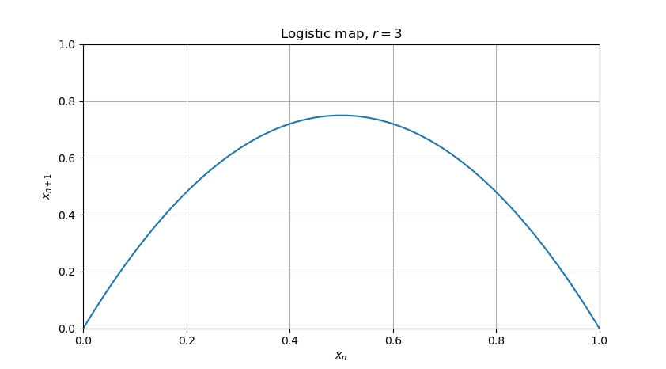

Title:        Boundary catastrophe
Description:  Featuring: leaky parabolas
Author:       Piotr Machura
Date:         2021-07-10

You know the logistic map? It goes something like

$$
x_{n+1} = rx_n(1-x_n)
$$

The $n$'s are the discrete time steps, $x_n$ is some value (say, 1-dimensional position) at time $n$ and $r$ is the
**control parameter** - some positive real number, for now let's assume $r = 3.75$.

The map is given by a **difference equation**, a discrete differential equation, which, as you can see, is
**nonlinear**.  It's often given as an example in any introduction to nonlinear systems, since it's hard to imagine
non-linear equations simpler than a quadratic.

If you were to graph the $x_{n+1}$ (the "next step") as a function of $x_n$ (the "previous step"), you would get
something like this:



There is a good reason I have limited the axis to $\langle0,1\rangle$ - if you were to start with some $x_0$ greater
than 1, say $x_0 = 3$, then
$$
x_1 = 2 \cdot 3\cdot (1-3) = -12, \hspace{10pt}
x_2 = 2 \cdot (-12) \cdot (1-(-12)) = -312, \hspace{10pt} \ldots
$$
and the $x_n$'s quickly diverge to $-\infty$. The following python snippet may convince you that the same is true for any $x_0 \lt 0$:
```python
x = [-0.1] # Feel free to try out different starting conditions
for _ in range(12):
  print(x[-1])
  x.append(3.75 * x[-1] * (1 - x[-1]))
```
So the $x_0$'s (and by extensions any $x_n$'s) **need** to be between $0$ and $1$, or else the sequence diverges, and it
diverges very quickly. Hold that thought.

## Spider's web
That's all well and good, you may say, but how would you even use such a plot? Sure, I can calculate $x_{n+1}$ if I know
$x_n$, but is there a *closed-form* for this map? A way to calculate $x_n$ from just the $n$ itself (together with a
start point $x_0$)? Well, the whole fun with nonlinear dynamics is that you **can't**. But you can write the **phase
trajectory** - the sequence of $x_n$'s starting at some chosen point $x_0$, say
$$
x_0 = 0.1, \hspace{5pt}
x_1 = 0.3375, \hspace{5pt}
x_2 = 0.8385, \hspace{5pt}
x_3 = 0.5079, \hspace{5pt}
x_4 = 0.9373, \hspace{5pt}
x_5 = 0.2205, \hspace{5pt}
\ldots
$$
for $r=3.75$, and, as you can see it's highly unpredictable. This can be surprising, since whatever it is we are doing
must be entirely **deterministic**. We don't roll a dice to determine the next $x_{n+1}$, and yet the sequence does seem random.

We can plot this using a **spider's web plot** - marking $x_0$ on the horizontal axis and drawing a vertical line until we
intersect with the parabola, where $y=x_{n+1}=x_1$. Then we need to get $x_1$ onto the horizontal axis, and it's easiest
done by drawing a horizontal line until we intersect with $l: x_{n+1} = x_n$. Then we "bounce" back up to the parabola,
finding $x_2$. Rinse and repeat.

Don't worry, this is much easier shown than explained.


And if I add more steps you'll see why the $x_n$ sequence seems random (now with just the parabola-intersecting points
for clarity).


The points cover the parabola fairly (although not completely) evenly. It makes sense why 
Well, the trajectory may be **chaotic** (which is the proper word for something deterministic, yet without a
recognizable patter), but is always "constrained" to the pictured fragment of the parabola - as long as we have started
with some $x_0 \in \langle0,1\rangle$ the $x_n$'s that follow have no right to escape *beyond* $\langle0,1\rangle$,
right?

## The leakage
